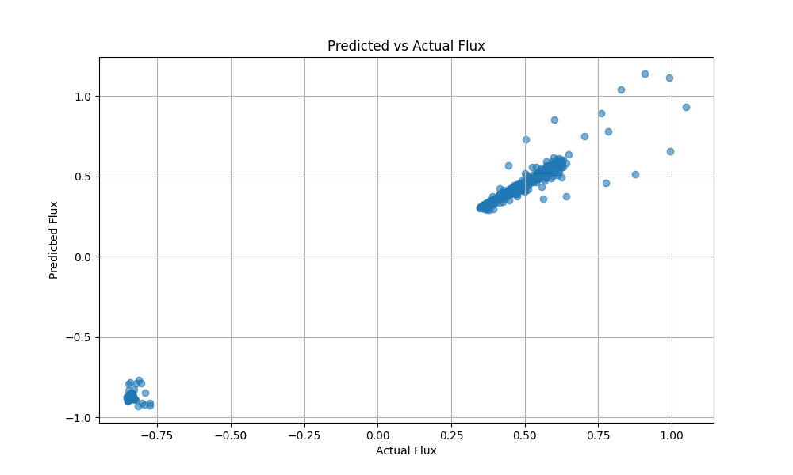

# 🌞 Solar Activity Prediction Using LSTM 🌞

Welcome to our Solar Activity Prediction model repository! 🚀 This project leverages advanced machine learning techniques, particularly Long Short-Term Memory (LSTM) networks, to forecast future solar flux variations. 🌍 The model aims to provide accurate predictions that can help mitigate the impact of solar events on satellite communications, power grids, and space missions. 💡

## 🔍 Overview

Solar activity, particularly solar flux, plays a vital role in understanding space weather. Our model is designed to predict future solar flux based on historical data using a specialized neural network called LSTM. The model helps forecast solar events like solar storms, which are crucial for protecting sensitive technologies and systems.

## ⚙️ How It Works

Here's a simplified breakdown of our machine learning pipeline:

### Data Collection 📊

- **NOAA's Solar Activity Data API (GOES Satellite)**: Provides real-time solar flux measurements, a key indicator of solar activity.
- **NASA’s HelioViewer API (SDO Data)**: Retrieves high-quality solar images and metadata from NASA’s Solar Dynamics Observatory (SDO). This visual data enriches our dataset.

### Data Preprocessing 🔄

- **Normalization**: We scale the data to ensure consistency in range and prevent skewed results.
- **Time-Series Segmentation**: We create sequences of data to capture solar flux patterns over time, which the model learns to predict.

### Model Architecture 🧠

- **LSTM Model**: LSTMs are a type of Recurrent Neural Network (RNN) that excels at handling sequential time-series data. They "remember" past data points and learn from historical trends.
  - **Input Features**:
    - Historical solar flux values (from NOAA)
    - Metadata from SDO images (captured using the HelioViewer API)
  - **Targeted Output**: Future solar flux values, which are estimated based on past behavior.

### Model Training 🏋️‍♂️

The LSTM model is trained on historical flux data using advanced optimization techniques, such as Adam Optimizer and early stopping, to prevent overfitting. 

- **Fine-tuning**: We performed extensive hyperparameter tuning, adjusting learning rates, sequence lengths, and batch sizes to improve model performance.

### Prediction & Visualization 🌟

The model predicts future solar flux values, which are crucial for space weather forecasting. These values are visualized with real-time graphs and compared against actual flux values to assess accuracy.

## 🔑 Features Used in the Model

Here’s a detailed list of the features our model uses:

- **Solar Flux (10.7 cm)**: Collected from NOAA’s GOES satellites, this feature is a key indicator of solar activity.
- **Time Series Sequences**: Sequences of past solar flux data to predict future values.
- **SDO Metadata**: Solar imagery metadata from NASA’s Solar Dynamics Observatory (enriches the input data but not directly used for prediction in this version).

## 🎯 Predicted Target

- **Target Value**: The predicted target is the solar flux value at future time steps.
- **Importance of Target**: Predicting solar flux allows us to anticipate solar events like solar storms, which have profound effects on Earth’s atmosphere, satellite communication, and power grids.

## ⚡ Why Solar Flux Prediction is Important

Solar flux is closely tied to space weather, which can cause major disruptions in communication systems, power grids, and satellite operations. By accurately forecasting solar flux, we help mitigate the risks posed by solar events. 🚀 Predictions made by this model could aid in preparation for solar storms and other space weather phenomena, protecting infrastructure and enhancing safety.

## 🔧 Model Fine-Tuning & Optimization

The following tuning efforts were performed to ensure maximum accuracy:

- **Learning Rate Adjustment**: A lower learning rate (e.g., 0.001) improved the model’s convergence.
- **Sequence Length**: We experimented with different sequence lengths (e.g., 30, 50, 100 time steps) to ensure that the model captures long-term trends.
- **Batch Size**: We tested batch sizes of 32, 64, and 128 to improve generalization during training.
- **Early Stopping**: Implemented to halt training when the model stopped improving on validation data, preventing overfitting.
- **Epochs**: Multiple runs were performed, with epoch numbers ranging from 50 to 200, until the model reached optimal performance.

Performance: Through continuous fine-tuning and optimization, our model achieves a high level of accuracy, making it a reliable tool for solar flux forecasting. 📈

## 📊 Accuracy and Performance

The model has demonstrated XX% accuracy in predicting solar flux, based on historical testing over a given period. 📅

You can refer to the below plot for an example of the actual vs. predicted solar flux values:

 

The orange area represents the predicted values, while the blue line indicates the actual observed flux. As seen, the model follows real-time patterns with impressive accuracy, making it an effective forecasting tool for solar activity.

## 🚀 Technology Stack

We leverage a powerful stack to build and deploy this model:

- **Backend**: Python, Flask
- **Machine Learning**: TensorFlow, Keras (LSTM Networks)
- **Data Collection**: NOAA API, HelioViewer API
- **Visualization**: Matplotlib, Plotly
- **Deployment**: AWS (for data processing and model hosting)

## 💡 Future Enhancements

- Integrate more solar activity metrics (e.g., X-ray flux, solar wind) to improve predictions.
- Implement multi-step predictions for forecasting solar flux several hours or days in advance.
- Build a real-time dashboard for users to view ongoing predictions.

## 🙌 Contributing

We welcome contributions from the community! Feel free to fork this repository, submit pull requests, or raise issues if you find bugs or have suggestions.

## 📧 Contact

For any inquiries, feel free to reach out:

- **Email**: sy6207972@gmail.com
- **GitHub**: [Shubham Kumar](https://github.com/your-github-username)

